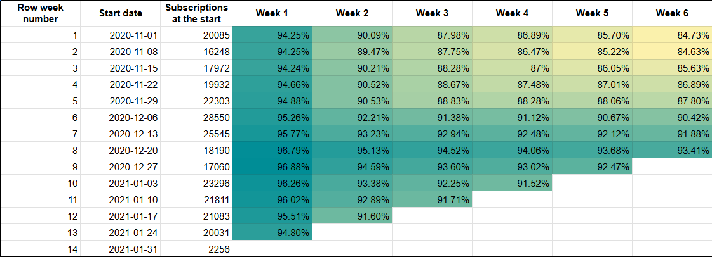
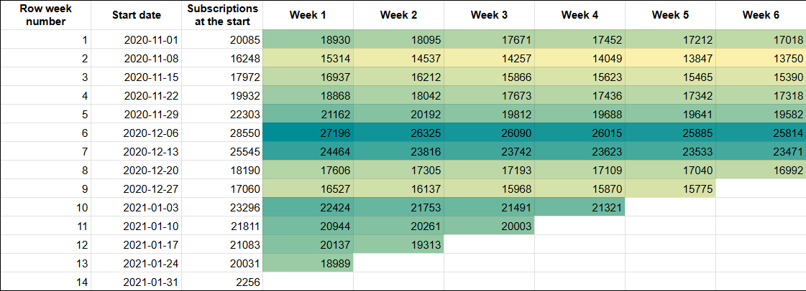

# Weekly Retention Cohorts Analysis for Subscriptions

## Introduction

This repository contains a focused analysis of weekly subscription retention cohorts. The objective was to examine subscription churn using SQL and basic cohort visualization. This project emphasizes SQL proficiency and cohort analysis skills, using data extracted from BigQuery and visualized in Google Sheets.

Since this was a learning task, it’s scoped to be a quick analysis rather than a comprehensive project.

## Dataset

This project was developed using a proprietary dataset provided for educational purposes, which is not included in the repository due to restrictions. Redistribution or commercial use of the project contents is not permitted.

The data contains information on subscriber activity with columns as follows:

- **"user_pseudo_id"** - unique, anonymized identifier for each subscriber.
- **"category"** - type of subscription access (e.g., "desktop" or "mobile").
- **"country"** - country of the subscriber.
- **"subscription_start"** - start date of the subscription for each user.
- **"subscription_end"** - end date of the subscription, if applicable (null if the subscription is active).

If you'd like to replicate the analysis, you may substitute with a similar dataset.

## Objectives

1. Analyze weekly retention and churn rates for subscribers.
2. Provide retention insights by week, focusing on patterns across a 6-week period.

## Tech Stack

- **SQL** (BigQuery) – for data extraction and cohort calculations.
- **Google Sheets** – for creating quick visualizations of cohort retention data.

## Key Findings

- Most subscriptions were started a couple of weeks before the Christmas period (starting 2020-12-06).
- Retention rates peaked for subscriptions started between late December and early January, with these subscribers showing the highest engagement in the following weeks.
- Retention began to decline in early January, suggesting a seasonal effect on subscription commitment.
- Even though most new subscriptions started just before the Christmas period, the ones who stayed longest were the ones who became subscribers during the main holiday weeks (2020-12-20 and 2020-12-27).

## Recommendations

- **Focus Marketing Efforts**: increase retention efforts or engagement campaigns for subscribers joining during high-churn periods, such as after the holidays.
- **Analyze Further**: consider extending the cohort analysis beyond 6 weeks to understand longer-term retention behavior.

## Possible Analysis Improvements

To enhance this project in the future, the following could be added:
- Optimizing the code and shortening it as cohorts and retention can be calculated using various approaches.
- Incorporating more variables to analyze different drivers of retention (e.g., device type, demographics).

## How to Use This Repository

1. **SQL query**: The SQL file contains the code used to extract the cohort data from BigQuery.
2. **images**: visualizations are provided in the screenshots.

## Contact
LinkedIn - [Agnė Vabalaitė](www.linkedin.com/in/agnė-vabalaitė).
Gmail - vab.agne@gmail.com
